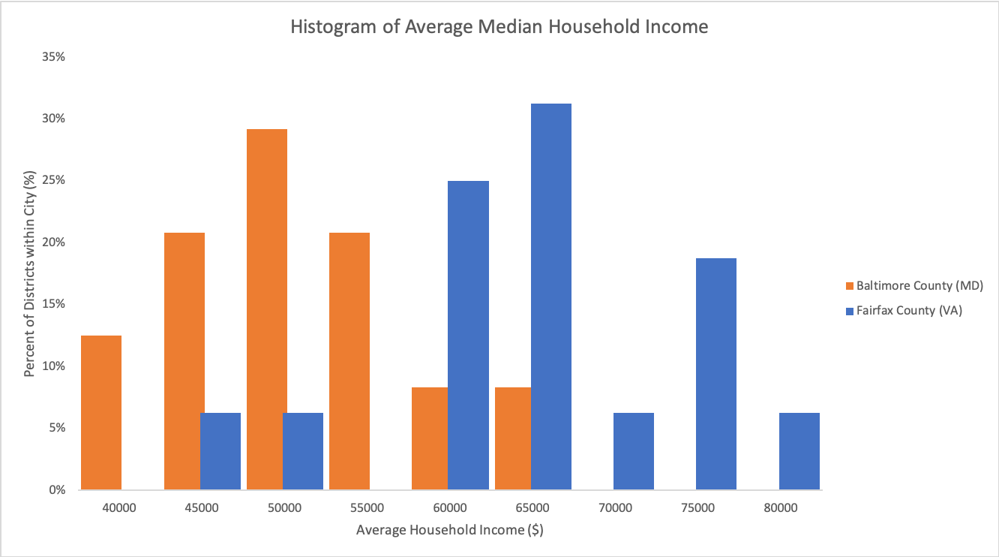

# comparing-baltimore-fairfax-householdincome
This project looks at household income data from Baltimore County and Fairfax County, presenting them together to analyze major trends. 

## Background:
Household income is one of the most fundamental and basic variables measured by the United States census every ten years. [Investopedia](https://www.investopedia.com/terms/h/household_income.asp) defines household income as the combined gross income, often reported adjusted for tax, of all household members aged 15 years or older. An important distinction in this definition is that household members do not have to be related as long as they are living under the same roof. As a metric, household income is a quick statistic that can be used to roughly compare economies of different cities as income is reflective of wealth and financial status. However, there are many factors that go into household income that vary between locations, such as standard of living conditions. For example, if a city in rural Florida has the same household income average as that of San Francisco, a direct comparison would lead you to believe that the populations are equally well off. However, when you factor in standard of living, expenses, and average salaries, it becomes apparent that the relevant area in Florida has individuals who are relatively more affluent than their San Francisco counterparts. 

Nevertheless, household income is a good overall metric for classifying the economic position of cities and judging real-estate prices or credit risk. The median household income in the United States was $61,936 in 2020. In this report, we compare household income data for Baltimore County, Maryland with that of Fairfax County, Virginia. Both counties are in the DMV region and encompass suburbs, with Baltimore County being a suburb of Baltimore City and Fairfax County being a suburb of Washington DC. Having grown up in Fairfax County, I’m curious to see the differences between income in the two DMV counties and to see if I have any related biases. 

## Business Question: 
The question then becomes: **How does average median household income differ between two major DMV counties—Baltimore and Fairfax?**

## Data Exploration:
To explore this question, I used the open-source [Opportunity Atlas](https://www.opportunityatlas.org/) database to download household income data for all of Baltimore County and all of Fairfax County. The raw data files are in the repository. After manipulating the raw data (as explained in the Data Analysis section), I generated an overlaid histogram for the two counties with median household incomes ranging from $40,000 to $80,000. Tables 1 and 2 show the frequencies of each income range for Baltimore and Fairfax, respectively. The data is visualized in Figure 1. 

Table 1 
Table 2 
Figure 1 

From the figure, it is clear that there is a difference between the average median income for Baltimore and Fairfax. The distribution for Baltimore County is left skewed, while the distribution for Fairfax County follows more of a normal distribution, but is slightly right skewed. The average median incomes are $48,794 for Baltimore and $61,925 for Fairfax, which is a stark difference of $13,131. It is interesting that the distribution for Baltimore is almost the inverse of the distribution for Fairfax. Both averages are just below the national average. 

## Discussion:
To answer the original question, the difference between the average household income for Baltimore and Fairfax is $13,131. However, it is interesting that both counties have an average lower than the national average of $61,936, though it is important to note that the average for Fairfax County is within range of the national average with a difference of ~$10. One explanation for this is the data from Opportunity Atlas is not from the 2020 census, so our analysis uses data lower than the current averages. 

The distributions between Baltimore and Fairfax are striking since they are almost inverses. Fairfax County is considered one of the most [affluent counties](https://www.bizjournals.com/washington/news/2017/07/18/greater-washington-has-half-of-the-nations-richest.html) in the United States. However, there is a lot of variability between the different tracts as seen in Table 2 and Figure 1. On the other hand, Baltimore has more frequency for each bin with less variability across the income range. As someone who grew up in Fairfax County, my biases and perception are inherently that there is a wide range in standard of living across a relatively small area. Thus, I've grown up seeing that there are certain areas that have larger stores and more resources based on what part of the county you are in. However, it seems as this may not be the case in Baltimore as there is less income variability across the region, with a few notable outliers in Pikesville and Ellicott City, both of which are suburbs. The differences between Fairfax and Baltimore incomes can be due to a variety of factors, including the industrial-nature of the economy in Baltimore compared with the corporate-focused economy in Fairfax, which is heavily influenced by DC. Industrial economies have typically been densely packed based on factories and pay less than corporate positions or government-based jobs. However, household income is just one metric and can be easily influenced by factors not reflected by this simple data. It would be interesting to correlate household income wtih rent prices in the area or poverty levels to gain a deeper understanding of the socioeconomic differences between the two counties. In all, these findings have led me to be more aware of the biases I may have in terms of resource distribution and accessibility of economic opportunities between Fairfax and Baltimore. This analysis makes it clear that Baltimore County and Fairfax County are large and cover many tracts. Legislators should be aware of the income distribution across this region and be careful not to make policy decisions based on county-wide averages as that many lead to benefiting only a few tracts at the expense of the others.

## Data Analysis:
To process the raw data, I first used the UNIQUE function in excel to consolidate the tract names from repeat entries of the same tract. I then used the SUMIFS function to parse through income data that matched the name of the consolidated tracts to create a running sum of income wtihin each tract. This step got rid of the duplicate entries while still accounting for all data points. Since Fairfax County only had data for suburbs, I only included the major Baltimore suburbs for the graph to keep the two comparisons as parallel as possible. Future studies may want to explore the differences between Baltimore suburbs and Baltimore city. I used the COUNTIF function to count the number of times income data was being summed so I could take the average for each tract by dividing the sum by count. I then created bins ranging from $40,000 to $80,000 with $5,000 increments to form the x-axis of the histogram. Using the FREQUENCY function on the consolidated averages, I assigned the incomes to a bin and converted the frequency into a percentage by dividing the frequency by total number of entries. I then plotted the histogram as a bar graph, changing the gap width to zero to create the graph. Using the same process for both data sets, I then overlaid the graphs by adding a new data series. The axes did not need to be changed since both counties had the same bin sizes and used percentage. 
